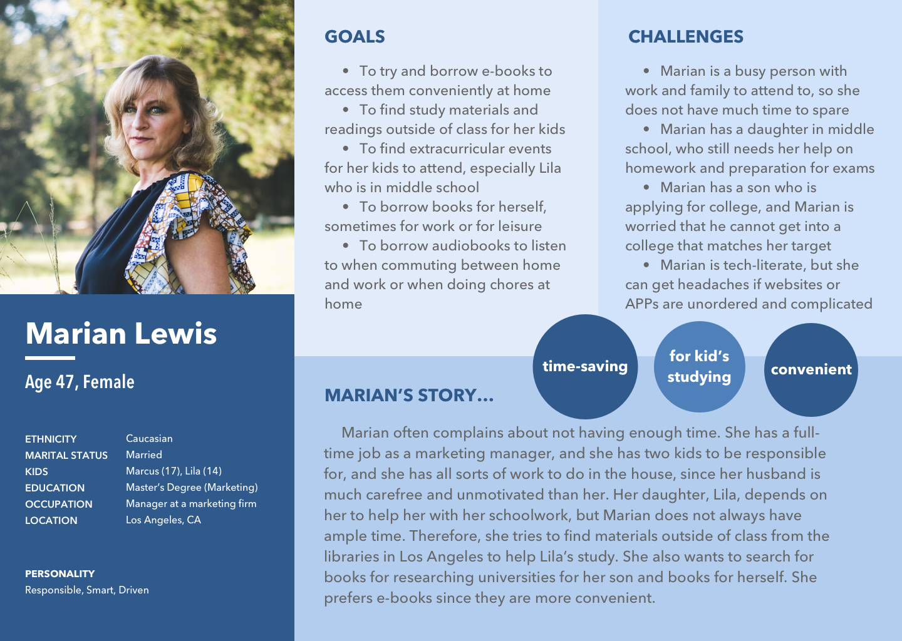
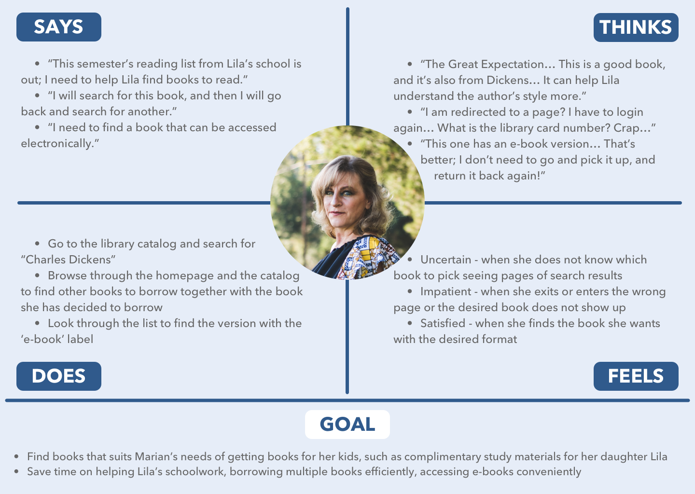
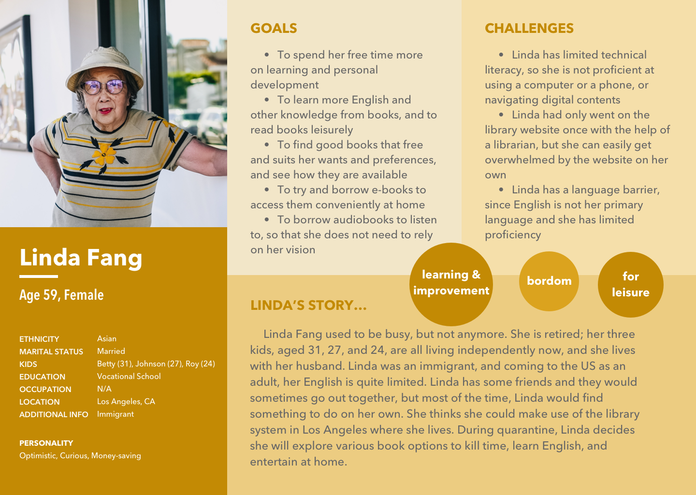
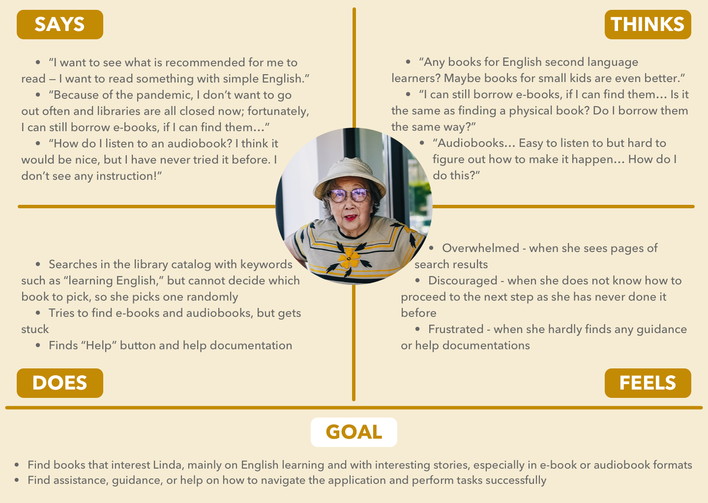
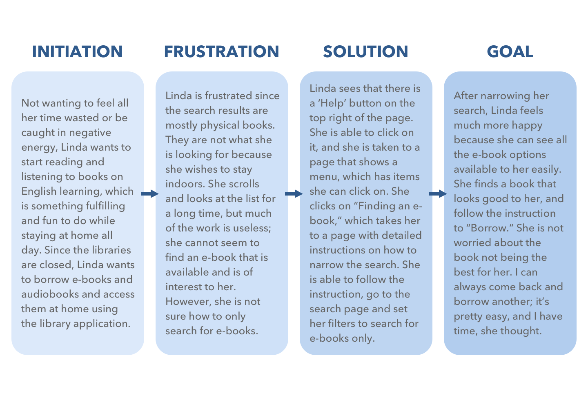
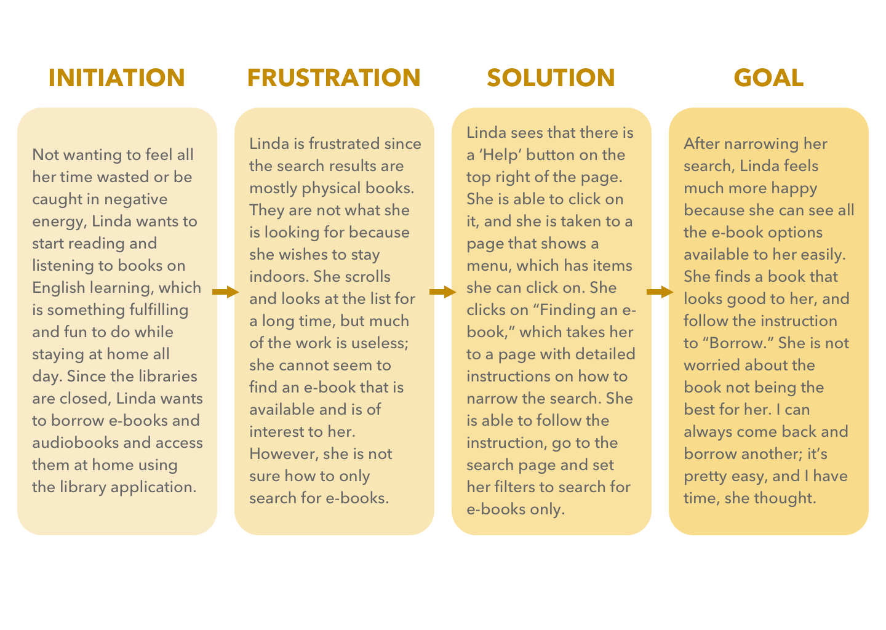

# UX Storytelling — Persona and Scenario
## Digital Humanities 150 Assignment 5 — Jane Huang

UX storytelling allows us to dive deep into the user's stories and scenarios, and see what the roles of the product is. This ensures that our design is user-centered and human-centered. I will use 2 personas with empathy maps and their scenarios and journey maps to look at how the LAPL application can fit into the picture.

Features that the design will focus on are:
* Search page: clear and concise search page with search filters for users to narrow their searches
* Results recommendation: results page after user's search includes a recommendation section to help overwhelmed users make their decision
* Help and documentation: help button and documentation provides guidance and specifies steps for users to perform

### Persona and Empathy Maps

#### Marian Lewis' Persona

 

#### Marian Lewis' Empathy Map

 

#### Linda Fang's Persona

 

#### Linda Fang's Empathy Map

 

### Scenarios and Journey Maps

#### Marian Lewis' Scenario

#### Marian Lewis' Journey Map

 

#### Linda Fang's Scenario

paragrpah

phagrarasr

#### Linda Fang's Journey Map

 

