# High-Fidelity Prototype
## Digital Humanities 150 Assignment 7 — Jane Huang

### Description

The Los Angeles Public Library Application has its main feature being the searching and finding for items in the library catalog. Moreover, there should be help documents and guidance. The LAPL APP needs to be accessible and easy to understand for all users, including the users we are focusing on — middle-aged women. Based on the persona created revolving around this project and its user group, features of the LAPL APP include:

* *Search functions*: clear and concise search page, with multiple search options
  * Includes Basic Quick Search, Advanced Search (with filters), and Featured Search (for tailored search experience, especially for users that are not looking for a specific item)
* *Results recommendation*: results page after user's search includes a recommendation section
  * Offers the user the option to choose to browse the recommendation section, which includes featured search results from librarian recommendations, popular books, etc.
* *Item Requests*: user can request an item on their account and place a hold
  * Allows users to select location, etc. and borrow the item
* *Help and documentation*: help button and documentation provides guidance
  * Provides help for main actions with specific steps, and the 'help' button is clearly present on most pages for easy direction to the help page

The purpose of this high-fidelity prototyping is to visualize the information and interactive aspects of this project and to put them into screens of real sizes. This is not only a continuation from the low-fidelity prototypes, but also a realization of the concepts of this project and a design process of the application. The high-fidelity prototype show screen designs that incorporates graphical components, color schemes, and takes into account accessiblity concerns and friendly user-interface design, etc. Also, the prototypes include an interactive component, which takes into consideration the interactive flow that a user would experience.

The tasks the prototype demonstrates are:
* Searching Library Catalog directly: the user can go to Library Catalog, type key words in the search bar, go to results page, select an item, and request an item (place a hold on their library account).
* Find an item using the Featured Search and Smart Recommendation functions: the user can go to Library Catalog, go into Featured Search, select options they are potentially interested in, get results, see Smart Recommendation section, find recommended items, select an item, and request an item.
* Using help documentation to figure out how to use Advanced Search to search for an item: the user can go to Help (from any page), look at documentation for how to use Advanced Search, go to Advanced Search, type key words in the search bar and filter results, go to results page, select an item, and request an item.

### Prototype Design

For the prototype, I used the tool Figma to design all the screens for my APP.

* **An Overview of the Prototype Design**:
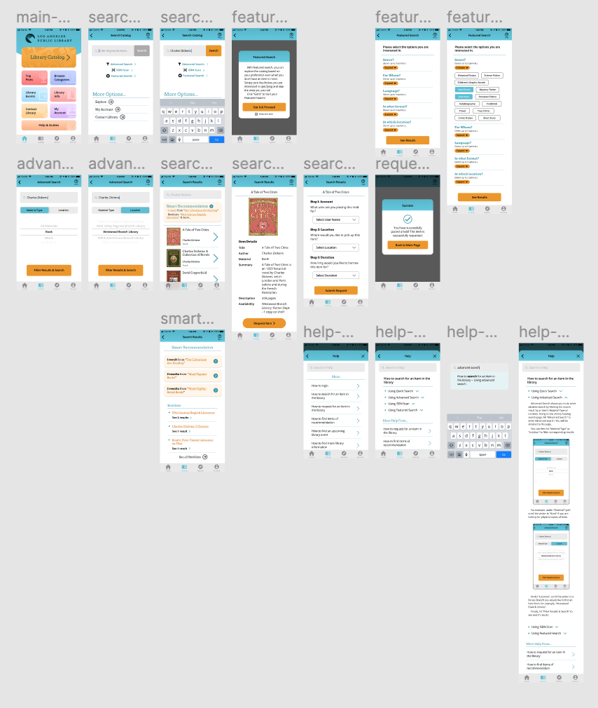

See complete prototype [here](https://www.figma.com/proto/5KcVoq7lYpXk0fWosbrV1H/DH150-HiFiPrototype-Interaction?node-id=53%3A2&scaling=scale-down).

* Color Scheme
For the color scheme, I tried out multiple options. I referred to the original version of the LAPL APP, which uses #53B3C8 (greenish-blue) as its main color. It also uses a blue color as a complementary color. I do like the use of the greenish-blue, as it is neither borning nor frivolous. However, the use of the blue color does not complement the design quite well, and these two colors do not have enough visual contrast. I also referred to the LAPL website, which uses orange and dark blue as its color scheme. The dark blue gives a slightly monotonous and depressing impression, but the orange suits the tone or style of a digital library tool. I alter the greenish-blue (#59BFD5) slightly to make it a bit more attractive; orange (#ED9819) complements the color quite well. The two colors creates contrast, which is a more visually attractive pair to the users, and they allow the interface to have more variability and the functions to have better visability. Also, the color scheme is also dull or too familiar to the users, which allows them to remember the application better.

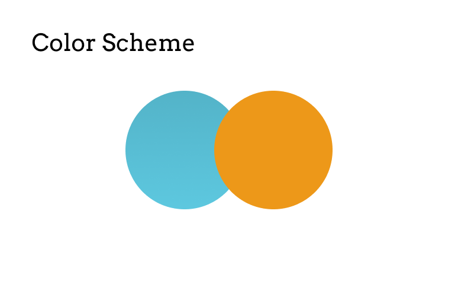

* Text Font
The APP uses two text fonts: Arvo and Open Sans.  

#### Iterations

There are some iterations during the design process. For example, going through interactive details, I realized I can make my design better or correct my design by making components more visible, or by making sure the interactive flow is always smooth.

* Design with better visability — Making buttons more visible

For a screen for "Featured Search," I first used black fonts with some variations (bold) and also an orange arrow for the "Expand" function. However, the screen looks plain, since there are not many variations in style on this page, and the key elements which require interaction are not popped up enough — the orange arrows are too small. Therefore, for the next iteration, I changed the design of the "Expand" function to buttons that are much more visible and stood-out. Also, it tends to be consistent with other screens of design, as the users are used to the pattern that orange are mostly used for buttons.

Before  | After |
:---:  | :---:  |
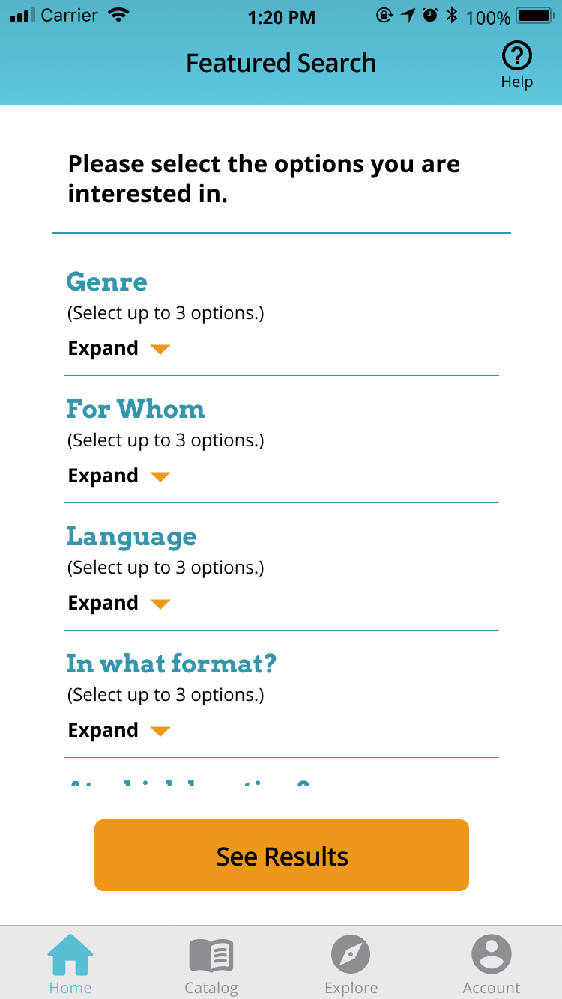  | 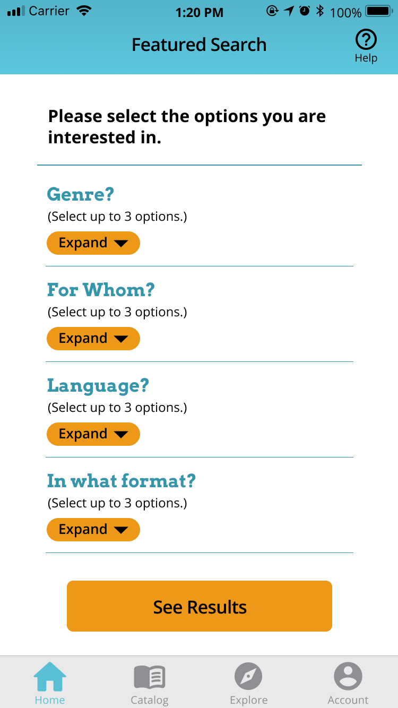  |

* Design for good interactions — Attending to low between pages

I thought about having a pop-up notification-like introduction when the user enters "Featured Search," and I designed the interface based on my idea by designing the effect of the background dimmed when the 'notification' pops up. However, when I got back to the design, I figured that the design could potentially 'lock' the user in this screen — meaning that they have to proceed to the next screen, even in the case when they want to exit (maybe they don't want to use Featured Search after all, or they just accidently click on the wrong thing). Therefore, I made changed to my design. First, I made sure that the design included a back arrow so that the user can always go back. Also, I made the tab bar visible while the background is dimmed.

Before  | After |
:---:  | :---:  |
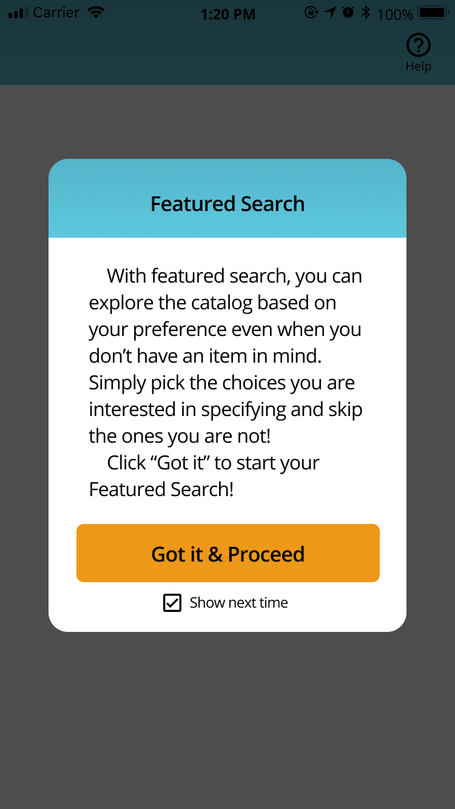  | 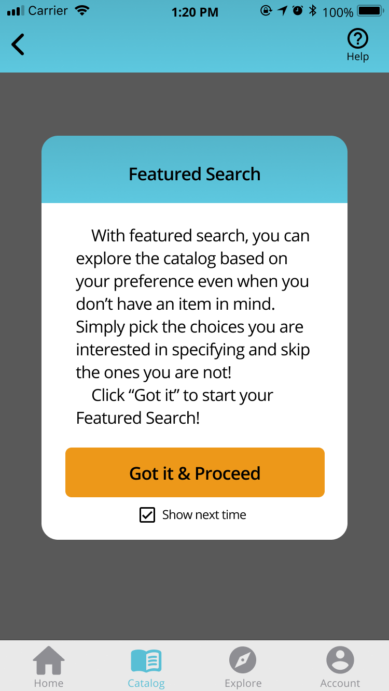  |

* Design with clear and succint elements — Making user experience efficient

For the "Advanced Search" filtering page, I thought for a good while how to make the interface minimalist, clear, and good-looking. I have several trials, and I first ended up with a segmented control with 2 buttons and a pull-down menu. It serves the purpose of selecting what the user wants, but I decided to see if I can make the design better. First, for the segmented control, I tried another design that is less flat, which is not only more aligned with the current design trend, but also gives the user a more intuitive sense to manipulate the buttons. Moreover, I found that my initial design lack enough visability, so I change the colors. The design of a white button with a greenish-blue background looks nice; however, the issue is that as one of the main colors of this APP, it can potentially be confusing to the user when the greenish-blue when it is not used to highlight some component but used as a background color. Therefore, the design is not good enough. I changed the greenish-blue to be the button color, which makes more sense. Also, I make sure the text color is black for accessibility concerns. Furthermore, I thought I could improve the pull-down menu by changing it to a picker. This is because it increases efficiency — the pull-down menu would require clicking, scrolling, and clicking; while the picker would essentially only require scrolling (to get the item at the center). Therefore, the design makes the page clearer and the action of the users more succint.

Iteration 1  | Iteration 2 |
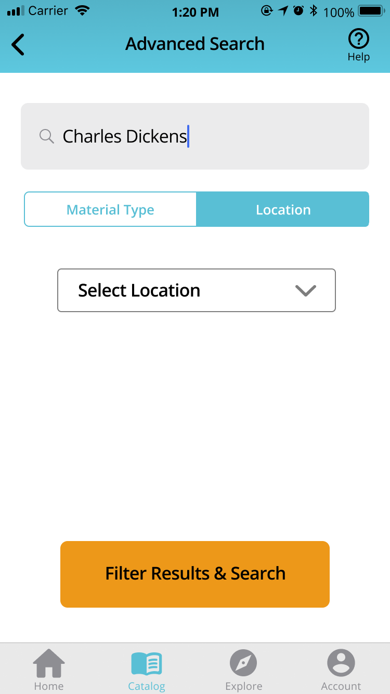  | 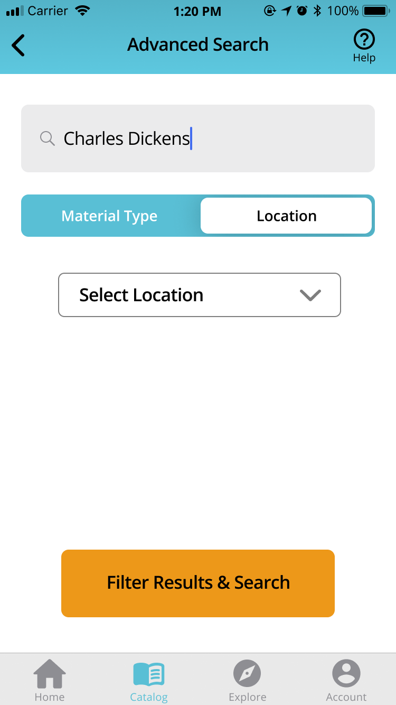  |
:---:  | :---:  |
Iteration 3  | Iteration 4 |
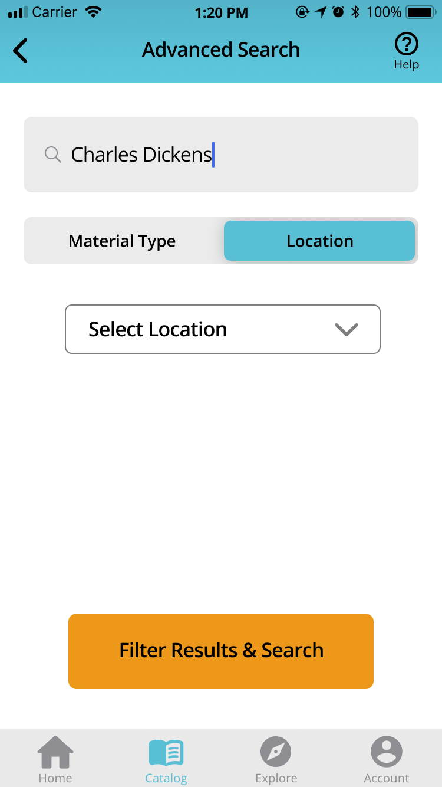  | 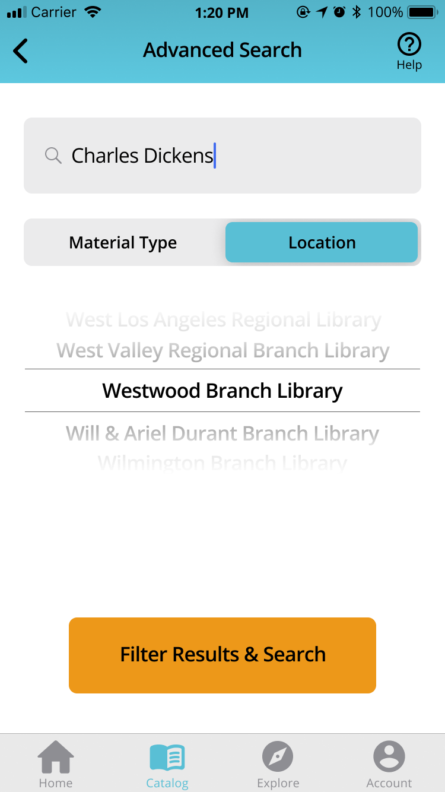  |

### Impression Test

> The colors are nice.

To begin with, I asked 3 people separately for the impression test of the color scheme. They were satisfied with the color scheme; I showed them more than one option, but they tend to think the current colors are better. therefore, I decided to go with the current color scheme. Moreover, I showed them the prototypes (screen designs) briefly, and ask for their impression. When being asked about "What do you think the APP is mainly about?", they were able to say what it is intended to do — they all mentioned 'library.'

> It is for searching, finding, and borrowing books.

> It allows you to use the library catalog to place a hold.

Moreover, one mentioned that they noticed "Smart Recommendation," which is part of the search result. They also noticed the "Help" function. Two people said that they like the "Help" function in this APP.

> I like it that there is a "Help" button on every screen.

For a general impression, they said that the prototypes have a clean interface. One said they like it that some screens are scrollable. In terms of the design style, one said that they personally like sharp corners instead of rounded ones for buttons and other components, which is different from the current design. However, after collecting more opinions, I decided to keep the current design as more people are satisified with the current design style.

### Accessibility (color-contrast) check

The design satisfies the standard of color contrast for the accessibility WCAG2.0 AA level. I used a plugin in Figma for the test for accessibility, Able.
Here are the screenshots of the color-contrast report:

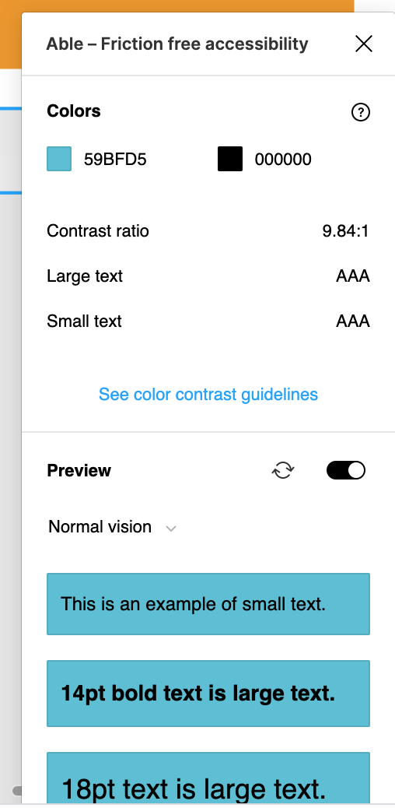  | 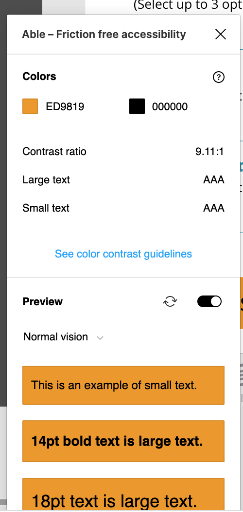  |
:---:  | :---:  |

As shown above, the color #59BFD5 (greenish-blue) and #ED9819 (orange) satisfy the color-contrast accessibility standard.

### Interaction

* **An Overview of the Prototype Design**:
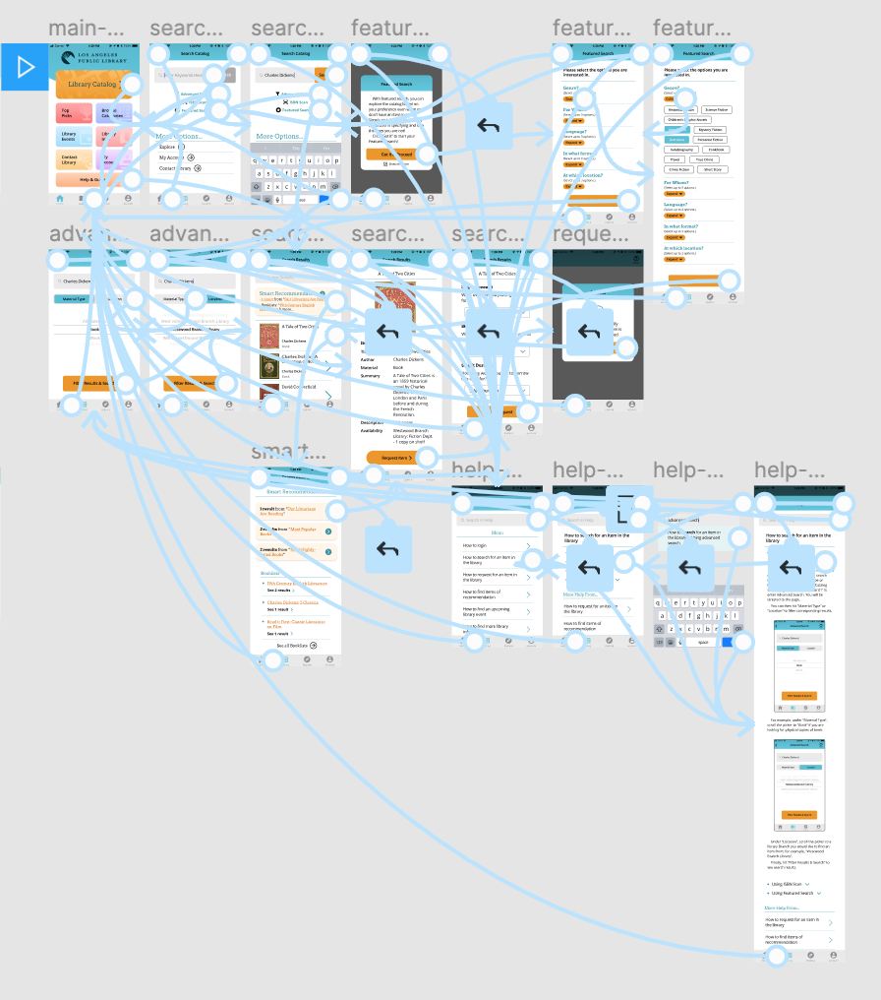

The interactive prototype for the LAPL APP can be accessed [here](https://www.figma.com/proto/5KcVoq7lYpXk0fWosbrV1H/DH150-HiFiPrototype-Interaction?node-id=53%3A2&scaling=scale-down).

### Cognitive Walkthrough

After being introduced to the project, the persona, and the tasks, the tester is asked to walk through the tasks with the interactive prototype. The tester is asked to answer some questions.

Q: Do you think the users can understand what this screen (feedback) is about?
> Yes.
Q: Do you think the users can recognize this (interaction point/ information)?
> Yes.
Q: Do you think the users can feel that the progress is being made toward what they want to achieve?
> Yes.
Q: Is there anything inconsistent, missing, or confusing?
> No. User is able to follow the process.

Overall, the cognitive walkthrough went smoothly, and the tester was able to successfully follow the process and go through the tasks.

### Reflection

The process of creating the high-fidelity prototypes was time-consuming but rewarding for me. I put in quite a lot of time into creating the prototype, and it is great to see the project come into shape and have testers playing with prototype outcome. I have learned that all the work done before creating the high-fidelity prototype build great and crucial foundation. While I was working on the hi-fi prototypes, the prototypes went out naturally because there were enough planning and research done before the process. Even though I was constantly adjusting the design, it was more about the details and the aesthetics, and less about the big structure since it was laid out with the wireframes. Moreover, when creating the hi-fi prototypes, I found that I was able to achieve most things I wished to achieve. It was interesting for me to explore and make some screens scrollable while keeping some components fixed on the screen. However, there are also some ideas that I could not fully build into my prototype, perhaps due to the prototyping tool and my familiarity with it. For example, a feature which I hoped to but was unable to do is letting a message show only once for the user, after which they could specify whether they wish to see the message or not (by checking or unchecking a checkbox). These features would make the prototype even more realistic, but the hi-fi prototype works well without them, and I believe these can be better achieved in a design process in which development is also involved.

After designing the interactive prototype, and based on the feedback from the prototype testing, I would like to design the main page differently. The design of the main page currently seems a bit overwhelming in terms of the color, and although it serves the purpose of presenting the functionalities of the APP, the design is not very aesthetically pleasing. I have spent a lot of time trying different designs of the main page, but I still think it is not very satisfying.

