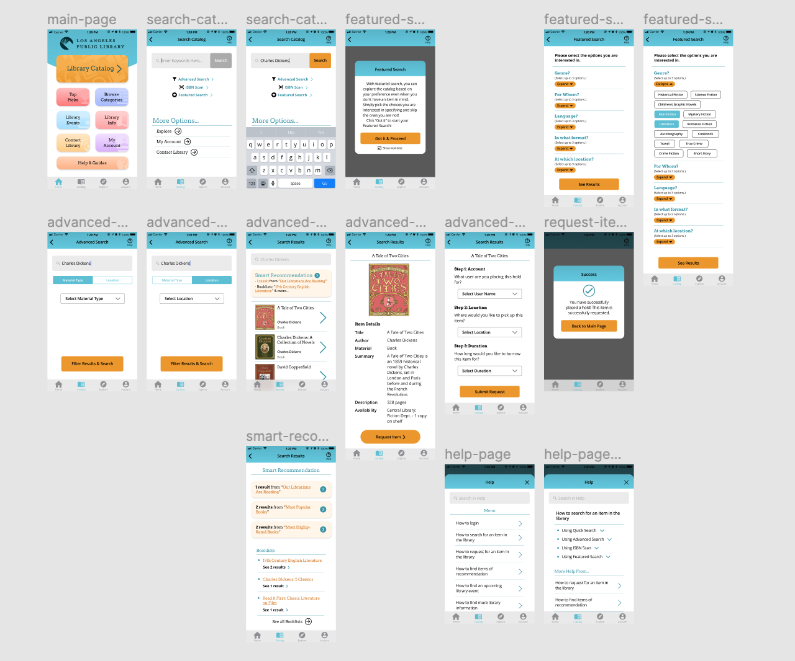

# High-Fidelity Prototype
## Digital Humanities 150 Assignment 7 — Jane Huang

### Description

The Los Angeles Library Application has its main feature being the searching and finding for items in the library catalog. Moreover, there should be good compatibility and well-documented help documents and guidance. Based on the persona created revolving around this project and its user group, the features that are mainly showcased are:

* **Search functions**: clear and concise search page, with multiple search options
  * Includes Basic Quick Search, Advanced Search (with filters), and Featured Search (for tailored search experience, especially for users that are not looking for a specific item)
* **Results recommendation**: results page after user's search includes a recommendation section
  * Offers the user the option to choose to browse the recommendation section, which includes featured search results from librarian recommendations, popular books, etc.
* **Item Requests**: user can request an item on their account and place a hold
  * Allows users to select location, etc. and borrow the item
* **Help and documentation**: help button and documentation provides guidance
  * Provides help for main actions with specific steps, and the 'help' button is clearly present on most pages for easy direction to the help page

The purpose of this high-fidelity prototyping is to visualize the information and interactive aspects of this project and to put them into screens of real sizes. This is not only a continuation from the low-fidelity prototypes, but also a realization of the concepts of this project and a design process of the application. The high-fidelity prototype show screen designs that incorporates graphical components, color schemes, and takes into account accessiblity concerns and friendly user-interface design, etc. Also, the prototypes include an interactive component, which takes into consideration the interactive flow that a user would experience.

[the tasks the prototype demonstrates.]

### Prototype Design

For the prototype, I used the tool Figma to design all the screens for my APP.

* An Overview of the Prototype Design:

For the color scheme, I tried out multiple options. I referred to the original version of the LAPL APP, which uses #53B3C8 (greenish-blue) as its main color. It also uses a blue color as a complementary color. I do like the use of the greenish-blue, as it is neither borning nor frivolous. However, the use of the blue color does not complement the design quite well, and these two colors do not have enough visual contrast. I also referred to the LAPL website, which uses orange and dark blue as its color scheme. The dark blue gives a slightly monotonous and depressing impression, but the orange suits the tone or style of a digital library tool. I alter the greenish-blue slightly to make it a bit more attractive; orange complements the color quite well. The two colors creates contrast, which is a more visually attractive pair to the users, and they allow the interface to have more variability and the functions to have better visability. Also, the color scheme is also dull or too familiar to the users, which allows them to remember the application better.

See the complete prototype (first version) [here](https://www.figma.com/proto/BgBBmFmmqa0yH74IGZhD7a/DH150-HiFiPrototype1?node-id=53%3A244&scaling=scale-down).

#### Iterations

There are some iterations during the design process. For example, going through interactive details, I realized I can make my design better or correct my design by making components more visible, or by making sure the interactive flow is always smooth.

* Making buttons more visible

For a screen for "Featured Search," I first used black fonts with some variations (bold) and also an orange arrow for the "Expand" function. However, the screen looks plain, since there are not many variations in style on this page, and the key elements which require interaction are not popped up enough — the orange arrows are too small. Therefore, for the next iteration, I changed the design of the "Expand" function to buttons that are much more visible and stood-out. Also, it tends to be consistent with other screens of design, as the users are used to the pattern that orange are mostly used for buttons.

Before:

After:

* Designing for corrections based on interactions

I thought about having a pop-up notification-like introduction when the user enters "Featured Search," and I designed the interface based on my idea by designing the effect of the background dimmed when the 'notification' pops up. However, when I got back to the design, I figured that the design could potentially 'lock' the user in this screen — meaning that they have to proceed to the next screen, even in the case when they want to exit (maybe they don't want to use Featured Search after all, or they just accidently click on the wrong thing). Therefore, I made changed to my design. First, I made sure that the design included a back arrow so that the user can always go back. Also, I made the tab bar visible while the background is dimmed.

Before:

After:
 

### Impression Test

> The colors are nice.

To begin with, I asked 3 people separately for the impression test of the color scheme. They were satisfied with the color scheme; I showed them more than one option, but they tend to think the current colors are better. therefore, I decided to go with the current color scheme. Moreover, I showed them the prototypes (screen designs) briefly, and ask for their impression. When being asked about "What do you think the APP is mainly about?", they were able to say what it is intended to do — they all mentioned 'library.'

> It is for searching, finding, and borrowing books.

> It allows you to use the library catalog to place a hold.

Moreover, one mentioned that they noticed "Smart Recommendation," which is part of the search result. They also noticed the "Help" function. Two people said that they like the "Help" function in this APP.

> I like it that there is a "Help" button on every screen.

For a general impression, they said that the prototypes have a clean interface. One said they like it that some screens are scrollable. In terms of the design style, one said that they personally like sharp corners instead of rounded ones for buttons and other components, which is different from the current design. Therefore, I plan to collect more opinions and make potential alterations to my design.

### Accessibility (color-contrast) check

The design satisfies the standard of color contrast for the accessibility WCAG2.0 AA level. I used a plugin in Figma for the test for accessibility, Able. Here is the screenshots of the color-contrast report:

As shown above, the color #59BFD5 (greenish-blue) and #ED9819 (orange) satisfy the color-contrast accessibility standard.

### Interaction
### Reflection
