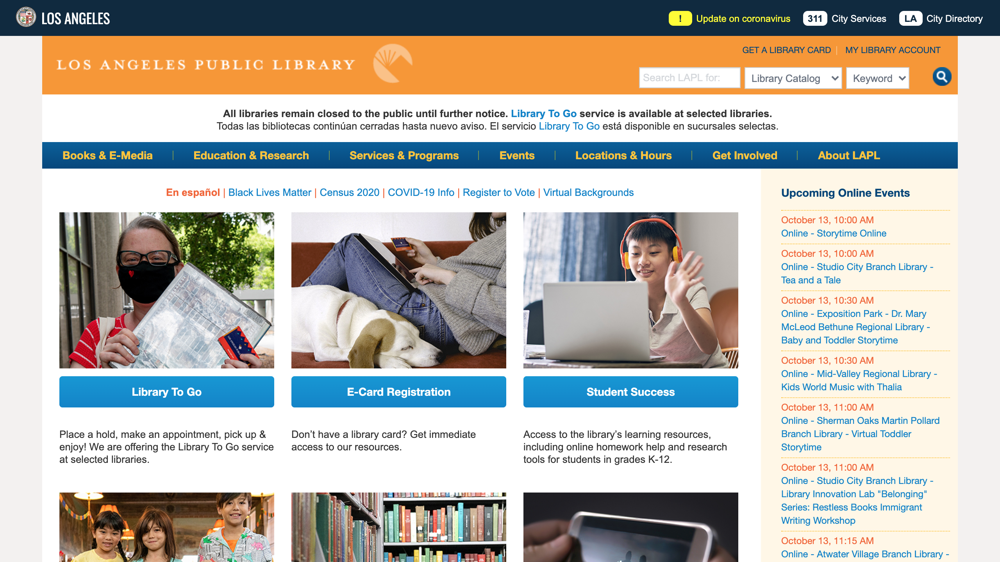
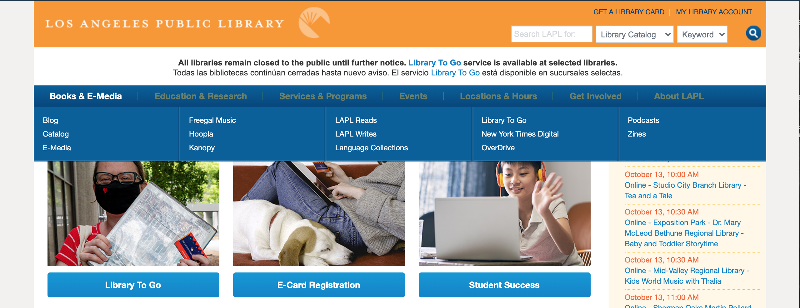
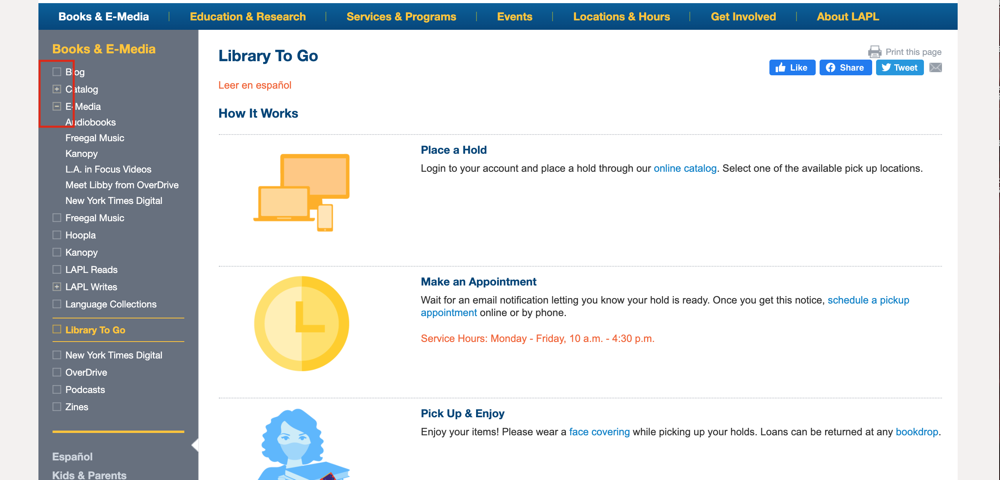
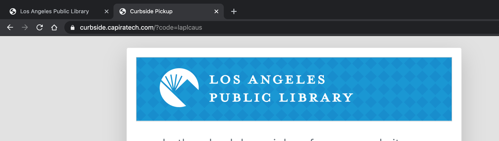
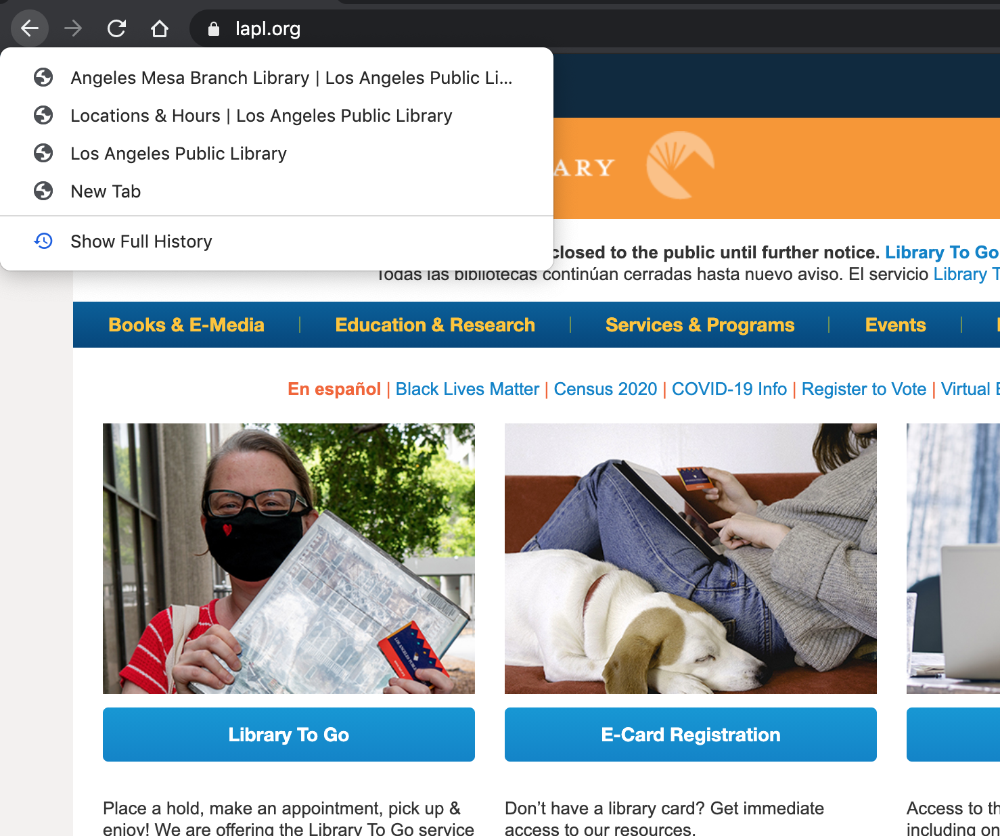
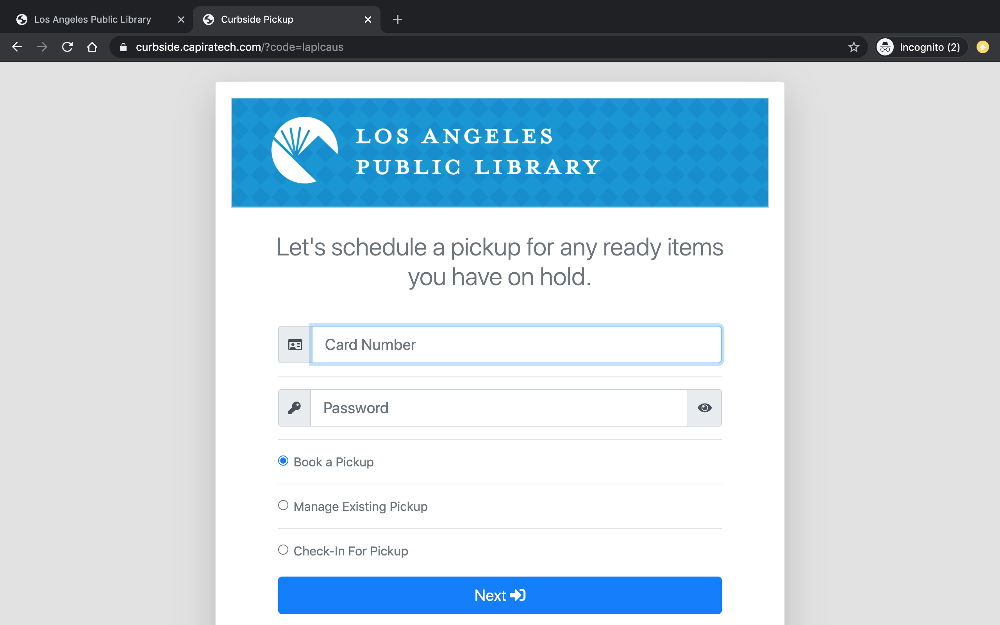
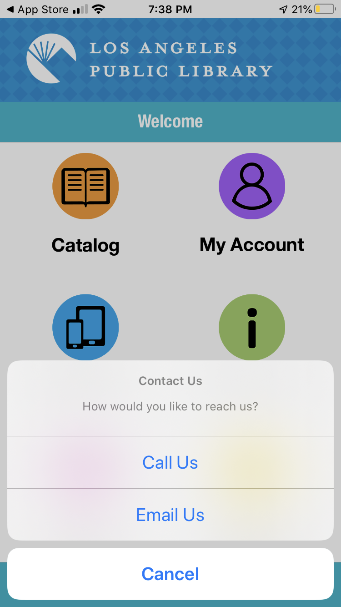

# Heuristic Evaluation
## Digital Humanities 150 Assignment 1 — Jane Huang

## Feeding the Mind

With the COVID-19 pandemic, we have entered a period of time when people are facing instability and uncertainty. As Los Angeles continues to be in a state of lockdown, more people are experiencing negative emotions such as anxiety and fear. Although middle-aged women are not usually under the spotlight of the social realm of discussion, they are a group that cannot be neglected. Focusing on the happiness of middle-aged women, I hope to, in this project, explore a way of providing an outlet of the real world. By improving the user experience, it can make sure these users can find the process of using the product enjoyable and that the overall experience brings happiness.

## Analysis of Website: [Los Angeles Public Library](lapl.org)

The Los Angeles Public Library (LAPL) is a public library system that serves residents in LA, serving the largest population among all publicly funded library systems in the United States of over 18 million residents. Holding more than 6 million volumes, the LAPL system provides books, zines, periodicals, computer access, and audiovisual materials freely to the residents. The LAPL website contains information digitally that can be accessed and viewed by the users.

The LAPL website needs to be accessible and easy to understand for all users, including the users we are focusing on — middle-aged women.

 

In the heuristic evaluation, I will use Jakob Nielsen's 10 general principles for interaction design for this analysis.

I will use severity ratings to aid the heuristic evaluation. 

### Severity Ratings in Heuristic Evaluation (from [Nielson Norman Group](https://www.nngroup.com/articles/how-to-rate-the-severity-of-usability-problems/))
The severity of usability problems can be rated from a 1 to 3 scale as follows:
Rating  | Importance  |
:---: | :---  |
1  | Cosmetic problem only: need not be fixed unless extra time is available on project  |
2  | Minor usability problem: fixing this should be given low priority  |
3  | Major usability problem: important to fix, so should be given high priority  |

#### Usability Heuristic #1: Visibility of System Status
>The system should always keep users informed about what is going on, through appropriate feedback within reasonable time.

**Rating: 2**
* The LAPL website has appropriate and prompt response when the user hovers over something that is clickable. For example, the menu would expand when the user hovers over a tab. A tab would change color to show its responsiveness. A link would be underlined to show it is clickable.

* However, the user needs to have experience with web products, and have good vision in order to detect every function. For some functions, the website has low visibility of the system status since the icon is too small, so it is difficult for the user to spot the possible actions they can perform.

**Recommendation:**
* Some feedback should have increased visibility, such as a more drastic change of colors.

* Some functions should be more visible for users to find in order to make use of those functions; for example, a filter bar on the left of the screen should have more visible \[+\](for expanding) and \[-\] [-] (for collapsing) icons.

#### Usability Heuristic #2: Match Between the System and the Real World
>The system should speak the users' language, with words, phrases and concepts familiar to the user, rather than system-oriented terms. Follow real-world conventions, making information appear in a natural and logical order.

**Rating: 2**
* The LAPL website follows real-world conventions in general. For example, the main page has a collection of information and makes use of a menu bar to contain shortcuts to subpages. The main page also serves as an eye-catching page of the product that allows user to decide if there are contents that catch their eyes.

* The website has too much information, which can be overwhelming to the user. If a user is not used to viewing a digital site with loads of information, the user can be confused. It is different from a more traditional form of media or books that it presents too much information on one page.

**Recommendation:**
* The website should consider putting less information on one page, so that every feature can be presented in a more conspicuous way. Otherwise, some good features can be neglected by the users who need them.

* Consider mimicking an actual library, or the status of an actual book - this would enhance the user experience for elder users as they would be more used to a skeuomorphic design.

#### Usability Heuristic #3: User control and freedom
>Users often choose system functions by mistake and will need a clearly marked "emergency exit" to leave the unwanted state without having to go through an extended dialogue. Support undo and redo.

**Rating: 1**
* Being a website that exists within a web browser, it naturally has the function of going back to a page that the user has previously browsed, therefore allowing the user to "exit" the current page quite easily.

* If users are redirected to a new page in a new tab, they can still access the previous tab/tabs by clicking on them.

**Recommendation:**
* Consider letting the menu bar with the drop-down list be consistently fixed on every page, so that users can easily go to the pages they have been to before.

#### Usability Heuristic #4: Consistency and standards
>Users should not have to wonder whether different words, situations, or actions mean the same thing. Follow platform conventions.

**Rating: 2**
* The website follows many design conventions and standards, which makes it intuitive for the user. For example, the search bar is located on the top right of the page (consistent with the convention that search bars are usually shown on the top right or middle), with a text box and a magnifying class icon (universally used for search icon).

* There are some minor issues that can potentially make the user confused. For example, in the "Schedule Your Pickup" page, the menu on the right has collapsing and expanding icons. They are against user experience convention: the arrow should be pointing down when the list is collapsed and up when the list is expanded.

**Recommendation:**
* Some details should be redesigned to make the user experience more smooth and intuitive. As little as the direction of arrows can change how the user thinks and behaves.

#### Usability Heuristic #5: Error prevention
>Even better than good error messages is a careful design which prevents a problem from occurring in the first place. Either eliminate error-prone conditions or check for them and present users with a confirmation option before they commit to the action.

**Rating: 3**
* There is lacking error prevention for the user logging in. For example, when the user tries to put more digits in the text box intended for only 4 digits (of phone number), there is no error message stopping the user. Therefore, the user may waste time on figuring out what has been wrong with out the system's warning.

**Recommendation:**
* Add error prevention to prevent users from going to the next step while inputting the wrong information and spending time figuring out their mistake.

#### Usability Heuristic #6: Recognition rather than recall
>Minimize the user's memory load by making objects, actions, and options visible. The user should not have to remember information from one part of the dialogue to another. Instructions for use of the system should be visible or easily retrievable whenever appropriate.

**Rating: 2**
* There is a lot of redirection of links to other websites (some difficult to tell what it specifically does). Users can easily lose track of which website they should be on. The new links are often opened in a new tab, so users may be confused about when they should go back to the previous page or search for the other tabs.
  * For example, when the user tries to schedule a pickup from a library branch, they are redirected to https://curbside.capiratech.com/?code=laplcaus. It is difficult to remember which library this is, etc. since there is no explicit indication.

**Recommendation:**
* This is more about how ample and complicated the LAPL system is. The site can improve by making the tabs with links redirection more visible and more organized.

#### Usability Heuristic #7: Flexibility and efficiency of use
>Accelerators — unseen by the novice user — may often speed up the interaction for the expert user such that the system can cater to both inexperienced and experienced users. Allow users to tailor frequent actions.

**Rating: 2**

**Recommendation:**

#### Usability Heuristic #8: Aesthetic and minimalist design
>Dialogues should not contain information which is irrelevant or rarely needed. Every extra unit of information in a dialogue competes with the relevant units of information and diminishes their relative visibility.

**Rating: 1**

**Recommendation:**

#### Usability Heuristic #9: Help users recognize, diagnose, and recover from errors
>Error messages should be expressed in plain language (no codes), precisely indicate the problem, and constructively suggest a solution.

**Rating: 2**

**Recommendation:**

#### Usability Heuristic #10: Help and documentation
>Even though it is better if the system can be used without documentation, it may be necessary to provide help and documentation. Any such information should be easy to search, focused on the user's task, list concrete steps to be carried out, and not be too large.

**Rating: 2**

**Recommendation:**

-----

## Analysis of APP: Los Angeles Public Library (link to download provided [here](https://www.lapl.org/app))

The Los Angeles Public Library APP is another official virtual way to access the LAPL system. It is a mobile APP designed to be accessed on a smartphone; the LAPL promote this APP on its website with "Take the Los Angeles Public Library Everywhere You Go!" Therefore, the APP is meant to provide a convenient and accessible way to interact with the LAPL system. The main functions of the APP include:
* Searching the library catalog and reserve items,
* Managing your checkouts and holds,
* Accessing your digital library card, and
* Viewing upcoming events at your local library
at the palm of your hand.

The LAPL APP should be designed for all its library patrons as potential users.

In the heuristic evaluation, I will use Jakob Nielsen's 10 general principles for interaction design for this analysis.

I will use severity ratings to aid the heuristic evaluation. 

#### Usability Heuristic #1: Visibility of System Status
>The system should always keep users informed about what is going on, through appropriate feedback within reasonable time.

**Rating: 2**
* 

**Recommendation:**
* 

#### Usability Heuristic #2: Match Between the System and the Real World
>The system should speak the users' language, with words, phrases and concepts familiar to the user, rather than system-oriented terms. Follow real-world conventions, making information appear in a natural and logical order.

**Rating: 2**

**Recommendation:**

#### Usability Heuristic #3: User control and freedom
>Users often choose system functions by mistake and will need a clearly marked "emergency exit" to leave the unwanted state without having to go through an extended dialogue. Support undo and redo.

**Rating: 2**
* 

**Recommendation:**

#### Usability Heuristic #4: Consistency and standards
>Users should not have to wonder whether different words, situations, or actions mean the same thing. Follow platform conventions.

**Rating: 2**

**Recommendation:**

#### Usability Heuristic #5: Error prevention
>Even better than good error messages is a careful design which prevents a problem from occurring in the first place. Either eliminate error-prone conditions or check for them and present users with a confirmation option before they commit to the action.

**Rating: 2**

**Recommendation:**

#### Usability Heuristic #6: Recognition rather than recall
>Minimize the user's memory load by making objects, actions, and options visible. The user should not have to remember information from one part of the dialogue to another. Instructions for use of the system should be visible or easily retrievable whenever appropriate.

**Rating: 2**

**Recommendation:**

#### Usability Heuristic #7: Flexibility and efficiency of use
>Accelerators — unseen by the novice user — may often speed up the interaction for the expert user such that the system can cater to both inexperienced and experienced users. Allow users to tailor frequent actions.

**Rating: 2**

**Recommendation:**

#### Usability Heuristic #8: Aesthetic and minimalist design
>Dialogues should not contain information which is irrelevant or rarely needed. Every extra unit of information in a dialogue competes with the relevant units of information and diminishes their relative visibility.

**Rating: 2**
* This APP has a minimalist design, with 6 main icons to click into, and 2 icons on the tab bar. It is quite simple and clear. Even using it the first time, the user can quickly grasp its main functions.

* In terms of aesthetic, the use of color is quite random; moreover, the main color go astray the LAPL's official website, which makes it harder for users to form an impression. Also, the APP, in general, lacks aesthetic beauty (although it is not the priority), and it lacks any style that can make it more distinct or memorable.

**Recommendation:**
* While keeping the minimalist design, the APP should be redesigned with a more consistent and attention-grabbing aesthetic and style. The color should be treated with more care. For example, there can be a main color, consistent with the website, and one or more supplemental colors.

#### Usability Heuristic #9: Help users recognize, diagnose, and recover from errors
>Error messages should be expressed in plain language (no codes), precisely indicate the problem, and constructively suggest a solution.

**Rating: 1**
* In general, messages are clear and concise. They inform the user what the problem is.

**Recommendation:**
* Users may be more familiar to messages displayed in the middle of the screen on a mobile phone. However, messages displayed at the bottom is also clear and distinct.

#### Usability Heuristic #10: Help and documentation
>Even though it is better if the system can be used without documentation, it may be necessary to provide help and documentation. Any such information should be easy to search, focused on the user's task, list concrete steps to be carried out, and not be too large.

**Rating: 3**
* There is no help and documentation within the APP for the APP. Even though the APP does not have many functions, it is still necessary to provide guidance or some document for the user to refer to.

* The closest thing to help and documentation provided on this APP is an icon on the tab bar. If the user clicks on it, it provides the options "Call Us" and "Email Us." However, the contact information is not specific to inquiries of the LAPL APP itself, but it is rather for providing information for LAPL in general.

**Recommendation:**

* Help and documentation is necessary! For an APP for a large library system having 18 million potential users, facing every type of user, it would be important to have some form of help that the user can easily refer to. For example, having a 'help' icon at the top right which allows easy access to a help documentation (or a Q&A page) would be good.

-----

### Reference
* Wikipedia: Los Angeles Public Library (https://en.wikipedia.org/wiki/Los_Angeles_Public_Library)
* Nielson Norman Group: 10 Usability Heuristics for User Interface Design (https://www.nngroup.com/articles/ten-usability-heuristics/)
* Nielson Norman Group: Severity Ratings for Usability Problems (https://www.nngroup.com/articles/how-to-rate-the-severity-of-usability-problems/)
* Los Angeles Public Library (https://www.lapl.org/)
* Los Angeles Public Library App (https://www.lapl.org/app)
